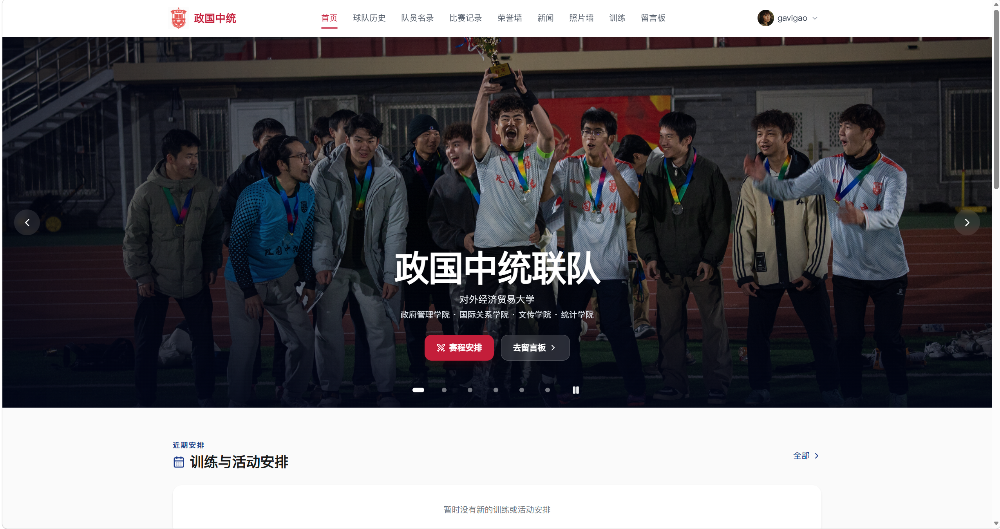
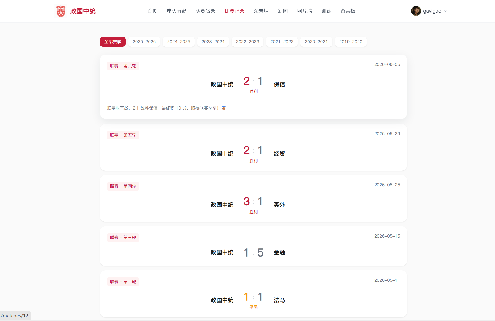
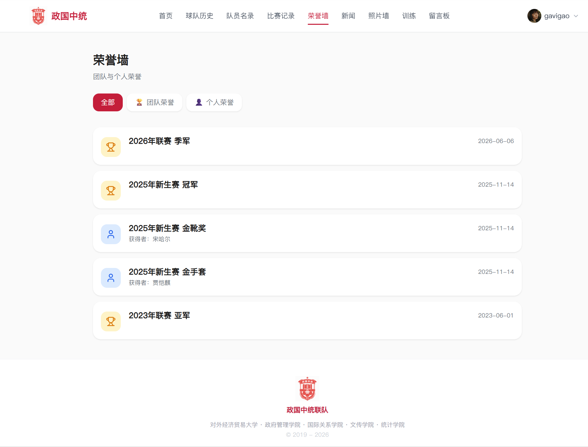
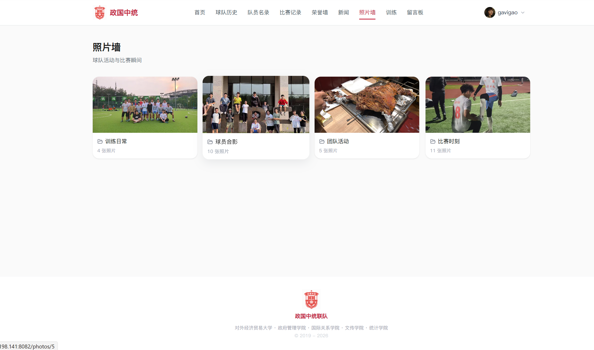
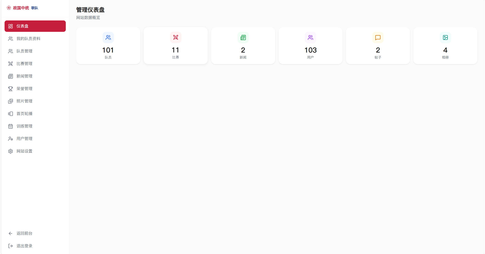

# ⚽ 政国中统联队官网

面向政国中统足球队的内容管理与成员互动平台：集中沉淀比赛、队员、训练、新闻和球队影像，让访客、队员与内容管理员在同一平台完成浏览、互动和日常维护。

> **项目当前状态**：核心功能已完成并部署至阿里云轻量服务器。正式域名正在备案/配置中，因此当前不将临时公网入口作为简历在线体验；项目截图将用于展示实际运行效果。

## 产品截图

以下截图来自项目当前运行版本，展示从球队门户、内容沉淀到后台维护的完整产品形态。正式域名仍在备案/配置中，暂以截图呈现实际效果。

| 页面 | 截图 | 展示重点 |
| --- | --- | --- |
| 首页 |  | 统一球队品牌入口，以及首页轮播与日常活动信息的承载方式。 |
| 比赛记录 |  | 按赛季组织赛程与赛果，沉淀可回顾的比赛记录。 |
| 荣誉墙 |  | 将球队和个人荣誉结构化展示，并支持分类浏览。 |
| 照片墙 |  | 将训练、比赛与团队活动以相册方式归档，保留团队记忆。 |
| 管理后台 |  | 通过后台集中维护球队内容，并概览队员、比赛、新闻、用户、帖子和相册数据。 |

> 截图保留了当前产品中的球队照片、账号头像和荣誉信息；对外公开前应确认相关成员的展示授权。

## 为什么做这个项目

球队长期会产生比赛记录、成员资料、训练安排、新闻和照片等内容。若只依靠群聊和零散文件，这些信息难以持续维护和回顾。

本项目将这些内容组织为可维护的网站，并在展示之外补充评论、点赞、留言板和管理后台，为球队保留可持续更新的公共信息空间。

## 核心功能

- **球队内容沉淀**：比赛、队员、球队历史、荣誉、新闻、相册与训练活动均可分类浏览；比赛支持赛季与赛事筛选。
- **成员互动**：注册用户可在比赛详情评论、点赞，也可在留言板发布帖子和参与讨论。
- **内容管理**：管理员可维护队员、赛程、新闻、荣誉、相册、训练和首页内容，减少依赖手工改代码更新信息。
- **账号与资料**：登录账号与公开用户名分离；用户可维护公开展示信息，避免用户名变更影响登录凭证。

## 产品与权限设计

| 角色 | 主要权限 |
| --- | --- |
| 访客 | 浏览公开内容、查看球队资料与比赛记录 |
| 注册用户 | 评论、点赞、发帖、维护个人公开资料 |
| 管理员 | 维护球队内容、处理社区内容 |
| 总负责人 | 在管理员权限基础上，任命或撤销管理员 |

关键设计包括：

- 将唯一登录账号与可修改、可重名的公开用户名分离；
- 评论、帖子与点赞均通过用户 ID 建立关联，避免展示名变化破坏历史内容；
- 角色权限由服务端实时读取，撤销管理员权限后旧 JWT 不继续保留管理能力；
- 点赞记录采用唯一约束去重，公开页面仅显示数量而不展示点赞者名单。

## 我的职责

我负责从产品定义到交付验证的完整过程：

1. 明确球队内容沉淀、成员互动和日常维护的产品范围；
2. 将需求拆解为用户流程、页面、接口、数据表、角色权限与验收要求；
3. 定义账号与公开用户名分离、内容管理、评论点赞和管理员边界等业务规则；
4. 组织前后端实现，并对关键交互、接口返回和权限行为进行验收；
5. 完成云服务器部署流程，并验证构建、健康检查、页面资源与关键接口。

## AI 协同开发

项目开发中使用 Codex、Claude Code 等 AI Coding 工具辅助需求拆解、功能实现、问题排查和迭代。AI 用于提高开发效率，而不替代产品与工程决策。

我会先提供业务背景、功能边界与验收标准，再通过多轮指令协作实现；对产出人工审查 Git Diff、生产构建、页面表现、API 返回和权限行为，并最终决定是否采用方案及是否发布。

## 技术实现

| 层级 | 技术 |
| --- | --- |
| 前端 | React 19、Vite 8、Tailwind CSS、React Router、Axios |
| 后端 | Node.js、Express、JWT、bcrypt、multer |
| 数据库 | MySQL 8、mysql2 连接池、utf8mb4 |
| 部署 | Nginx、PM2、Ubuntu 22.04、阿里云轻量服务器 |

```text
浏览器 → Nginx（静态资源 / API 反向代理） → Express → MySQL
```

## 部署与验证

项目已完成阿里云轻量服务器部署，前端由 Nginx 提供静态资源，后端由 PM2 管理，Nginx 将 `/api` 反向代理到 Express 服务。

正式域名备案与 HTTPS 配置完成前，不将临时 IP 入口作为对外作品集链接。发布与数据库迁移均遵循备份、构建、健康检查和关键页面/API 验证的流程；详细记录见 [docs/deployment.md](docs/deployment.md) 与 [docs/operations.md](docs/operations.md)。

## 本地运行

前提：Node.js 20+、MySQL 8+。

```powershell
# 配置本地环境变量（不要提交 backend/.env）
Copy-Item backend/.env.example backend/.env

# 初始化空数据库结构；如需演示内容，再导入脱敏样例数据
mysql -u <user> -p < backend/schema.sql
mysql -u <user> -p zgzt_team < backend/sample_data.sql

# 窗口 1：启动后端
cd backend
npm.cmd install
npm.cmd run dev

# 窗口 2：启动前端
cd frontend
npm.cmd install
npm.cmd run dev
```

## 更多文档

- [开发说明](docs/development.md)
- [部署说明](docs/deployment.md)
- [数据库与样例数据说明](docs/database.md)
- [运维说明](docs/operations.md)
- [产品决策记录](docs/product-decisions.md)
- [项目开发进度](项目开发进度.md)
- [用户使用指南](用户使用指南.md)

---

*最后更新：2026-08-30*
